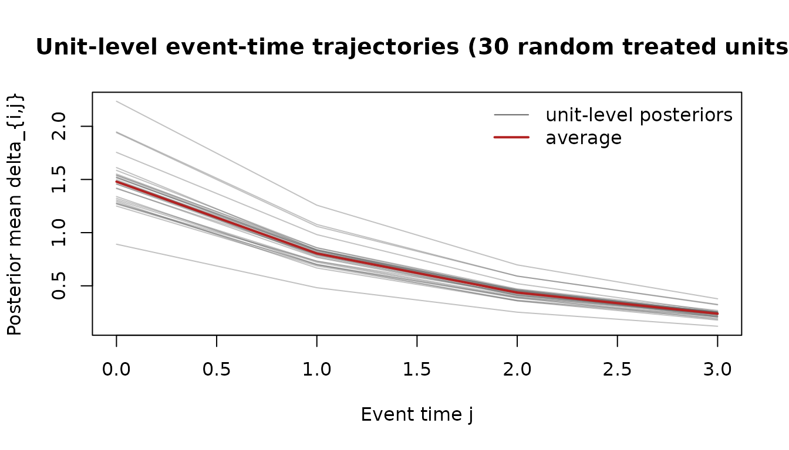
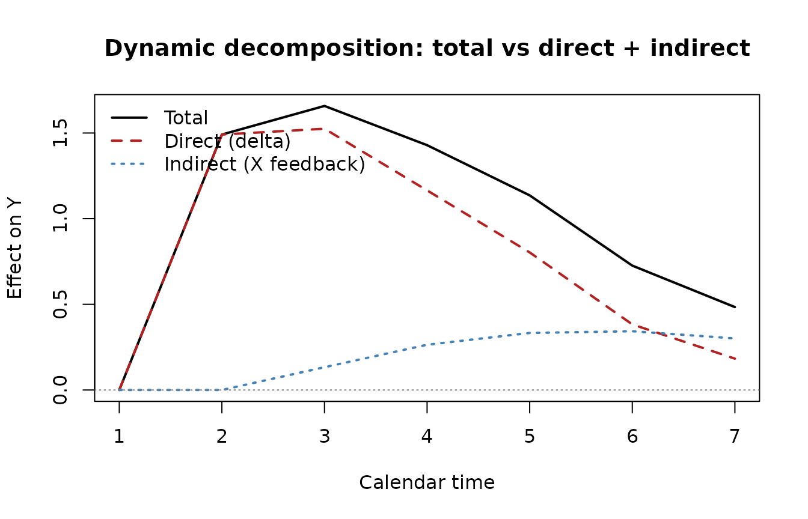

# Illustrative TV-HTE event study (with feedback decomposition)

This vignette uses a synthetic panel to show the `tvhte` workflow. The
panel has persistent outcomes, heterogeneous dynamic responses,
staggered adoption, and a covariate that responds to past outcomes. We
fit the structural TV-HTE model from Botosaru and Liu (2025), then the
homogeneous-feedback model from Botosaru and Liu (2026), and use the two
fitted objects to separate direct and indirect dynamic responses.

The DGP here is synthetic only because the BL 2025 county-unemployment
analysis (their Section 6) does not ship replication data. The workflow
on real panel data is identical: swap the simulated `Y`, `Y0`, `X`,
`X0`, `t0` for your own panel arranged the same way.

## Setup and DGP

``` r

library(tvhte)
set.seed(11)

# Mixed cohort: half treated at t = 3, a quarter at t = 5, a quarter never.
N <- 1500; T <- 7
cohorts <- sample(c(3, 5, Inf), N, replace = TRUE, prob = c(0.5, 0.25, 0.25))

sim <- simulate_tvhte(
  N = N, T = T, t0 = cohorts, J = 3,
  rho_Y     = 0.45,   # persistent outcome
  rho_delta = 0.55,   # treatment effect decays with event time
  sigma_U   = 1, sigma_eps = 0.3,
  mu_alpha  = 0,      mu_delta0 = 1.5,    # average DATT at impact = 1.5
  sigma_alpha = 0.6,  sigma_delta0 = 0.5, # heterogeneity in both
  cor_alpha_delta = 0.3,
  beta = 0.4,
  feedback_gamma = c(intercept = 0.1, gamma_Y = 0.25,
                     gamma_X = 0.4,  sigma_eta = 0.3),
  seed = 11
)
str(sim, max.level = 1)
#> List of 9
#>  $ Y     : num [1:1500, 1:7] -1.13 1.688 0.535 1.409 0.081 ...
#>  $ Y0    : num [1:1500] -0.988 -0.272 0.525 0.371 0.689 ...
#>  $ X     : num [1:1500, 1:7, 1] -0.861 -0.735 1.443 -0.617 0.74 ...
#>  $ X0    : num [1:1500] -1.613 -2.34 2.151 -1.091 0.203 ...
#>  $ t0    : num [1:1500] 3 3 Inf 3 3 ...
#>  $ J     : num 3
#>  $ lambda: num [1:1500, 1:2] -0.355 0.016 -0.91 -0.818 0.707 ...
#>  $ delta : num [1:1500, 1:4] 1.571 0.988 2.142 1.116 2.218 ...
#>  $ params:List of 11
```

The simulated panel has `N = 1500` units observed at `t = 0, 1, ..., 7`.
Three cohorts (treated at 3, treated at 5, never treated) are mixed in
known proportions. The covariate `X_{it}` adjusts each period in
response to lagged `Y` and lagged `X` — the homogeneous-feedback DGP of
BL 2026.

## Fit the structural model

``` r

fit <- tvhte(
  Y  = sim$Y,
  Y0 = sim$Y0,
  t0 = sim$t0,
  J  = sim$J,
  X  = sim$X,
  compute_se = TRUE
)
print(fit)
#> Time-Varying Heterogeneous Treatment Effects (Botosaru-Liu 2025)
#>   N = 1500 units; T = 7 periods; staggered (3 cohorts: 3:n=750, 5:n=381, Inf:n=369); J = 3
#>   log-likelihood = -16054.263   convergence = 0
#> 
#> Common parameters (theta):
#>   rho_Y      = 0.4769   (SE 0.01485)
#>   rho_delta  = 0.5434   (SE 0.01977)
#>   sigma_U    = 1.003
#>   sigma_eps  = 0.1411
#> Prior on lambda_i = (alpha, delta_0):
#>   mu = (0.0125, 1.476)
#>   sd = (0.5972, 0.493),  cor = 0.2837
#> 
#> Covariate coefficients (beta):
#>   beta[1] = 0.3538   (SE 0.02851)
#> 
#> Mean posterior event-time effects (across units):
#>   delta_0 = 1.4757   delta_1 = 0.8021   delta_2 = 0.4357   delta_3 = 0.2371
```

The QMLE recovers the dynamic parameters cleanly: `rho_Y`, `rho_delta`,
the covariate coefficient `beta`, and the prior moments of the
correlated random coefficients `(alpha_i, delta_{i0})`. The “mean
posterior event-time effects” line shows the average across units of the
unit-level empirical-Bayes trajectories — this is what an event- study
plot would show *aggregated* across units.

## Unit-level posterior trajectories

The empirical-Bayes step gives a per-unit `(alpha_hat, delta0_hat)` plus
the full event-time path `delta_{i,j}` for `j = 0..J`.

``` r

library(graphics)
# Show 30 randomly-chosen treated units' posterior trajectories
treated_idx <- which(is.finite(sim$t0))
sub <- sample(treated_idx, 30)
matplot(0:fit$J, t(fit$delta_path[sub, ]),
        type = "l", col = adjustcolor("grey40", 0.4), lty = 1,
        xlab = "Event time j",
        ylab = "Posterior mean delta_{i,j}",
        main = "Unit-level event-time trajectories (30 random treated units)")
# Overlay the cross-unit mean
lines(0:fit$J, colMeans(fit$delta_path[treated_idx, ]),
      lwd = 2, col = "firebrick")
legend("topright", legend = c("unit-level posteriors", "average"),
       col = c("grey40", "firebrick"), lty = 1, lwd = c(1, 2), bty = "n")
```



The trajectories fan out because the random coefficient `delta_{i0}`
varies across units. The average path (red) decays at roughly the
estimated `rho_delta`.

## Fit the feedback model

``` r

fb <- fit_feedback(sim$Y, sim$Y0, sim$X, sim$X0)
print(fb)
#> Homogeneous covariate-feedback process (Botosaru-Liu 2026)
#>   X_it = 0.09722 + 0.2519 * Y_{i,t-1} + 0.3986 * X_{i,t-1} + eta_it
#>   sigma_eta = 0.3008
```

The covariate `X_{it}` is modelled as an AR(1) with one lag of `Y` — the
simplest “homogeneous feedback” specification. Coefficients should sit
near the true `c(0.1, 0.25, 0.4)`.

Under the BL 2026 factorisation, the structural piece (fit by
[`tvhte()`](https://xiangao.github.io/tvhte/reference/tvhte.md)) and the
feedback piece (fit by
[`fit_feedback()`](https://xiangao.github.io/tvhte/reference/fit_feedback.md))
are estimated separately — neither needs a parametric specification of
the other.

## Counterfactual decomposition

[`simulate_counterfactual()`](https://xiangao.github.io/tvhte/reference/simulate_counterfactual.md)
implements BL 2026’s Algorithm 1: it draws latent types from the
estimated prior, evolves event-time effects via the AR(1), and
propagates `(Y, X)` jointly using the estimated feedback process. The
output is a joint counterfactual path `(Y_i^{T,*}, X_i^{T,*})`,
separating the **direct** effect (through `delta_{i,j}`) from the
**indirect** effect (through `X_t * beta`).

``` r

# Counterfactual 1: same units, treatment shifted earlier (t0 = 2)
cf_early <- simulate_counterfactual(fit, fb, t0_star = 2,
                                    N_star = 500, seed = 99)
# Counterfactual 2: same units, never treated
cf_never <- simulate_counterfactual(fit, fb, t0_star = Inf,
                                    N_star = 500, seed = 99)

# Difference at each calendar period gives the total dynamic response.
total_effect <- colMeans(cf_early$Y) - colMeans(cf_never$Y)

# Direct-only counterfactual: same treatment but freeze X at its baseline
# value (no feedback adjustment). We re-build by setting feedback gammas
# that ignore Y_lag and X_lag (so X stays at its intercept + noise).
fb_frozen <- fb
fb_frozen$coef["gamma_Y"] <- 0
fb_frozen$coef["gamma_X"] <- 0
cf_early_direct <- simulate_counterfactual(fit, fb_frozen, t0_star = 2,
                                           N_star = 500, seed = 99)
cf_never_direct <- simulate_counterfactual(fit, fb_frozen, t0_star = Inf,
                                           N_star = 500, seed = 99)
direct_effect <- colMeans(cf_early_direct$Y) - colMeans(cf_never_direct$Y)
indirect_effect <- total_effect - direct_effect

decomp <- data.frame(
  t = 1:T,
  total    = round(total_effect,    3),
  direct   = round(direct_effect,   3),
  indirect = round(indirect_effect, 3)
)
print(decomp)
#>   t total direct indirect
#> 1 1 0.000  0.000    0.000
#> 2 2 1.491  1.491    0.000
#> 3 3 1.658  1.525    0.133
#> 4 4 1.429  1.165    0.264
#> 5 5 1.136  0.803    0.333
#> 6 6 0.726  0.383    0.343
#> 7 7 0.484  0.183    0.301
```

``` r

matplot(decomp$t, decomp[, -1],
        type = "l", lty = c(1, 2, 3), col = c("black", "firebrick", "steelblue"),
        lwd = 2, xlab = "Calendar time", ylab = "Effect on Y",
        main = "Dynamic decomposition: total vs direct + indirect")
abline(h = 0, lty = 3, col = "grey50")
legend("topleft", legend = c("Total", "Direct (delta)", "Indirect (X feedback)"),
       lty = c(1, 2, 3), col = c("black", "firebrick", "steelblue"),
       lwd = 2, bty = "n")
```



The total dynamic response (black) is the sum of the direct structural
effect (red dashed — what the unit would experience holding the
covariate path fixed) and the indirect adjustment effect (blue dotted —
how much of the response is mediated by the covariate responding to past
outcomes and treatment). In the BL 2026 minimum-wage example, the direct
effect is the wage response holding firm input demand fixed; the
indirect effect is the additional response that flows through firms
re-optimising hours and employment composition.

## On real data

For an applied dataset, the workflow is the same:

1.  Arrange your panel as `(N x T)` outcome matrix `Y`, baseline vector
    `Y0`, optional `(N x T x K)` covariate array `X`, baseline `X0`, and
    length-`N` treatment-cohort vector `t0` (use `Inf` for never-treated
    units).
2.  Call `tvhte(Y, Y0, t0, J, X)` for the structural fit.
3.  Call `fit_feedback(Y, Y0, X, X0)` for the feedback fit.
4.  Counterfactual decomposition with
    [`simulate_counterfactual()`](https://xiangao.github.io/tvhte/reference/simulate_counterfactual.md).

The QMLE step under the Gaussian working prior is consistent for the
common parameters even when the true prior on `(alpha_i, delta_{i0})` is
non-Gaussian (Botosaru and Liu 2025); the empirical-Bayes step achieves
ratio optimality. The homogeneous-feedback factorisation delivers
separately-identified direct and indirect effects (Botosaru and Liu
2026).

## References

- Botosaru, Irene and Laura Liu (2025). “Time-Varying Heterogeneous
  Treatment Effects in Event Studies.”
  [arXiv:2509.13698](https://arxiv.org/abs/2509.13698).
- Botosaru, Irene and Laura Liu (2026). “Event Studies with Feedback.”
  *AEA Papers and Proceedings* 116: 70–74.
